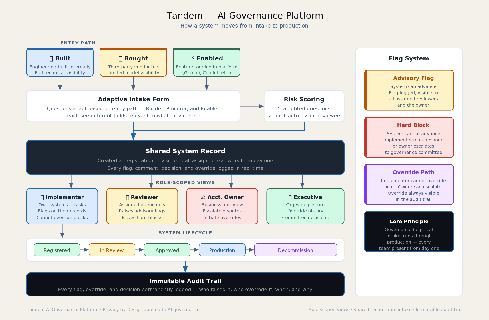

# Tandem: AI Governance Platform

*A reference overview of how the system works and what separates it from conventional governance approaches.*

---

---

## The Problem It Solves

Most AI governance programs are structured as a final gate: legal, ethics, and compliance review a system after the technical and product decisions have already been made. By the time governance is involved, the cost of changing anything is high enough that review becomes a formality. Tandem is designed around the opposite logic — get every function into the same record at intake, and keep them there through production.

## Three Entry Paths

How an AI system enters an organization determines what governance questions are actually relevant. Tandem routes intake through three paths:

**Built** covers systems developed internally, where engineering teams are the primary owners and questions about training data, model architecture, and deployment infrastructure apply.

**Bought** covers third-party systems procured through a vendor relationship, where the relevant questions center on data sharing agreements, vendor accountability, and contract terms.

**Enabled** covers systems that arrive as features inside existing tools — Gemini in Workspace, Copilot in Teams, AI features in a SaaS platform — where the entry point is an HR manager or department head toggling on a capability, not a procurement decision. This path tends to be the most undergovernanced because there is no formal procurement signal that triggers a review.

Each path adapts the intake form to surface only what is relevant, which reduces friction without reducing coverage.

## Shared System Record

The core architecture is a shared system record that legal, ethics, and engineering see from the beginning of the intake process. Rather than each function maintaining its own documentation and reconciling at the end, all activity on a system — flags, reviews, approvals, overrides, notes — lives in one record that everyone accesses in real time. This changes the nature of the governance conversation from a handoff to a collaboration.

## Role-Scoped Views

The same underlying record surfaces differently depending on who is looking at it. The **Implementer** view is task-oriented: what needs to be documented, what flags have been raised, what is blocking progress. The **Reviewer** view is judgment-oriented: what claims has the implementer made, where do advisory flags require a decision, where does a hard block need resolution before the system can advance. The **Accountable Owner** view presents the full picture for accountability purposes, including the escalation path when a reviewer and implementer disagree. The **Executive** view aggregates across all systems: portfolio risk posture, flags by category, lifecycle stage distribution.

## Immutable Audit Trail

Every action taken on a system record is permanently logged: flags raised, flags dismissed, overrides requested, overrides granted or denied, approvals, and any notes attached to those decisions. The log cannot be altered. This matters for two reasons. First, it creates accountability for the people making governance decisions, not just the teams building systems. Second, it makes the governance record useful in practice — when a system is under scrutiny six months after deployment, the full decision history is retrievable without reconstructing it from emails and meeting notes.

---

*The conceptual foundation is privacy by design applied to AI governance: embed the safeguards into the architecture of the process itself, review them throughout the lifecycle rather than at the finish line, and treat the audit record as infrastructure rather than documentation.*
